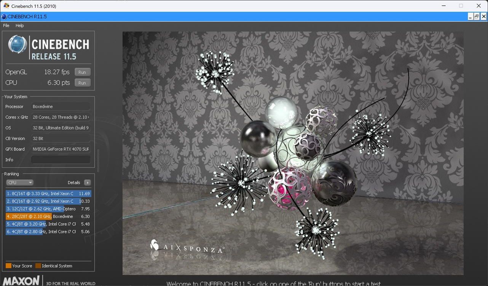

# Boxedwine

Boxedwine is an emulator that runs Windows applications.  It achieves this by running a 32-bit version of Wine, and emulating the Linux kernel and CPU.  It is written in C++ with SDL and is supported on multiple platforms.

Boxedwine is open source and released under the terms of the GNU General Public License v2 (GPL).

## Features

- Runs 16/32-bit Windows programs
- Works on Windows, MacOSX, Linux, and Web
- Can run multiple versions of Wine, from 3.1 to 10.0
- Apps and games using OpenGL, Direct3D and Vulkan are supported

## TODOs

- Emscripten/Web Boxedwine is still slow, need to implement a JIT.  Multi-threaded build also studders with sound.
- Mac OpenGL does not work with frame buffers
- Games after the year 2010 have limitted success at running
- Newer versions of .NET don't work
- Joystick support

## Platforms being tested

- Emscripten (WASM)
- Linux 64-bit x86/Arm64
- MacOSX (ARM)
- Windows 32-bit
- Windows 64-bit x86/Arm64

## Performance Test

### Cinebench 11.5 (Multi Core)

- **6.41** Windows 11 i7-14700 x64 Boxedwine
- **3.31** Mac OSX Mac Mini M4 Arm64 Boxedwine
- **1.41** Asahi Linux Mac Mini M1 Arm64 Boxedwine
- **1.16** Windows 11 i7-14700 x86 Boxedwine

### Cinebench 11.5 (Single Core)

- **0.48** Windows 11 i7-14700 x64 Boxedwine
- **0.59** Mac OSX Mac Mini M4 Arm64 Boxedwine
- **0.26** Asahi Linux Mac Mini M1 Arm64 Boxedwine
- **0.08** Windows 11 i7-14700 x86 Boxedwine

### Quake 2 +timedemo 1 +map demo1.dm2

- **76.7 fps** Windows 11 i7-14700 x64 Boxedwine
- **58.4 fps** Mac OSX Mac Mini M4 Arm64 Boxedwine
- **44.0 fps** Asahi Linux Mac Mini M1 Arm64 Boxedwine
- **29.5 fps** Windows 11 i7-14700 x86 Boxedwine

## Documentation

- [Upcoming Features](docs/Roadmap-Features.md)
- [Troubleshooting Games/Apps](docs/Troubleshooting-Games-Apps.md)
- [Developer Debugging](docs/Developer-Debugging.md)
- [How To Build Wine](docs/How-To-Build-Boxedwine.md)
- [How To Build OSMesa on MacOSX](docs/How-To-Build-OSMesa-on-Mac.md)
- [CPU Emulation](docs/CPUemulation.md)
