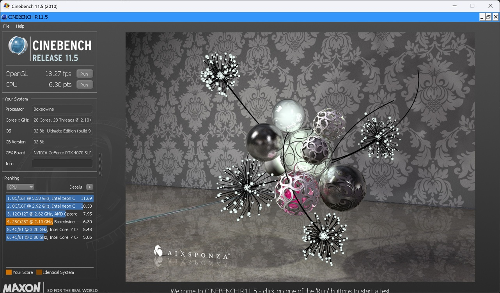

# Boxedwine

Boxedwine is an emulator that runs Windows applications.  It achieves this by running a 32-bit version of Wine, and emulating the Linux kernel and CPU.  It is written in C++ with SDL and is supported on multiple platforms.

Boxedwine is open source and released under the terms of the GNU General Public License v2 (GPL).

## Features

- Runs 16/32-bit Windows programs
- Works on Windows, MacOSX, Linux, and Web
- Can run multiple versions of Wine, from 3.1 to 11.0
- Apps and games using OpenGL, Direct3D and Vulkan are supported

## New Version 26R1
- 50% Faster for all platforms except WASM.  Uses 20% less memory for 64-bit builds.
- Added Wine 11 suport
- Added OpenGL on top of D3D12 for Windows ARM64 build
- Improved audio for Web builds, still not perfect

## TODOs

- Emscripten/Web Boxedwine is still slow, need to implement a JIT.  Multi-threaded build also studders with sound.
- Mac OpenGL does not work with frame buffers
- Games after the year 2010 have limitted success at running
- Newer versions of .NET don't work
- Joystick support

## Platforms being tested

- Emscripten (WASM)
- Linux 64-bit x86/Arm64
- MacOSX (ARM)
- Windows 32-bit
- Windows 64-bit x86/Arm64

## Performance Test with Wine 10

### Cinebench 11.5 (Multi Core)

- **10.02** Windows 11 i7-14700 x64
- **4.71** Mac OSX Mac Mini M4 Arm64
- **4.14** Windows 11 Snapdragon X - X126100 Arm64
- **3.90** Windows 11 i7-14700 x86
- **2.67** Asahi Linux Mac Mini M1 Arm64

### Cinebench 11.5 (Single Core)

- **1.01** Windows 11 i7-14700 x64 Boxedwine
- **0.84** Mac OSX Mac Mini M4 Arm64 Boxedwine
- **0.66** Windows 11 Snapdragon X - X126100 Arm64
- **0.50** Asahi Linux Mac Mini M1 Arm64 Boxedwine
- **0.42** Windows 11 i7-14700 x86 Boxedwine

### Quake 2 +timedemo 1 +map demo1.dm2

- **72.7 fps** Windows 11 i7-14700 x64 Boxedwine
- **88.9 fps** Mac OSX Mac Mini M4 Arm64 Boxedwine
- **65.7 fps** Asahi Linux Mac Mini M1 Arm64 Boxedwine
- **57.4 fps** Windows 11 i7-14700 x86 Boxedwine
- **57.3** Windows 11 Snapdragon X - X126100 Arm64

## Documentation

- [Upcoming Features](docs/Roadmap-Features.md)
- [Troubleshooting Games/Apps](docs/Troubleshooting-Games-Apps.md)
- [Developer Debugging](docs/Developer-Debugging.md)
- [How To Build Wine](docs/How-To-Build-Boxedwine.md)
- [How To Build OSMesa on MacOSX](docs/How-To-Build-OSMesa-on-Mac.md)
- [CPU Emulation](docs/CPUemulation.md)
