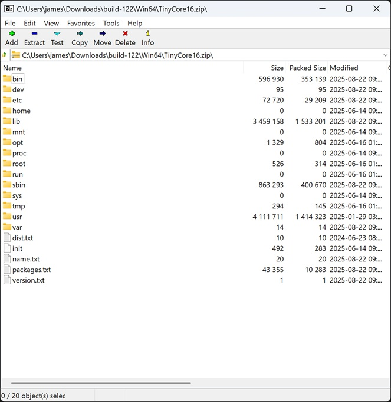

These instructions will allow you to build Tiny Core Linux base file system from scratch.  Most people will not want to do this.  This is mainly for me when I need to update to the next version of Tiny Core Linux.

## Core
In Linux

* Download Core from http://www.tinycorelinux.net/downloads.html
* Open Core-current.iso with Archive Manager and browse to boot\core.gz\core.cpio\
* extract everything in core.cpio to a folder, it should contain folder like usr, etc, root
* Convert the Linux links to Boxedwine links
> * In a terminal, go to the folder you extracted core.cpio to
> * Run this	
> *  ` find . -type l -exec bash -c 'realpath=$(readlink "{}"); rm "{}"; echo "$realpath" > "{}.link"' \; `
> * You can delete or change permissions for visudo and sudo if you want
> * I also removed lib\modules to slim it down a little
* Zip up contents so that usr, etc, root are at the top level
> * This is the base tiny core system, for TinyCore 16, it was about 3.8MB

## Base

* Now we need to add package/Boxedwine support
* Files to be added to the zip file at the top level (same level as usr, etc, root)
> * dist.txt : Add a file called dist.txt and put a value, like TinyCore16, in there.  This will be used as the folder name for the cached downloaded packages.
> * name.txt : This will be shown to the user in the Boxedwine UI.  Some like Tiny Core Linux 16.0
> * packages.txt : This will contain all the packages the user can add via the Boxedwine UI.  The first two lines are URLs to the package locations.  The first one I make the official location, the 2nd can be a backup.
> > * Example contents
> > * ` tinycorelinux.net/16.x/x86/tcz/ `\
	  ` tinycorelinux.net/16.x/x86/tcz/ `\
	  ` 8086tiny.tcz `\
	  ` 915resolution.tcz `\
	  ` 9vx-doc.tcz `\
	  ` ... `
> > * The package list can be copied from the url tinycorelinux.net/16.x/x86/tcz/
	
* Now your final file system should look something like this

* You can place this file system next to your Boxedwine executable and launch Boxedwine.
* In the Boxedwine UI, go to the Install tab, select Install Type: "Create Blank Container", select File System: "Tiny Core Linux 16.0" and hit the "Install" button.
* In the Boxedwine UI, go to the Containers tab, select the container you created. In the Packages drop down, one by one install the following:
> *  
